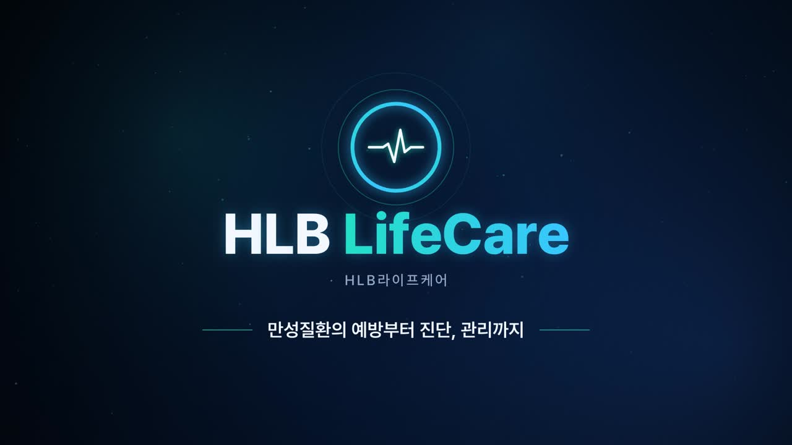

# HLB라이프케어 소개 영상



**결과물:** [`output/hlb-lifecare-intro.mp4`](output/hlb-lifecare-intro.mp4) — 1920×1080, 30fps, 72.5초, H.264 + AAC 스테레오

생성형 AI나 생성 크레딧을 쓰지 않았습니다. 화면은 Canvas 2D 코드로 직접 그렸고, 음악과 효과음도 numpy로 직접 합성했습니다.

## 디자인

- **로고:** 회사에서 받은 로고 파일(`src/assets/hlb-lifecare-logo.png`)을 그대로 씁니다. 빨간 배경 위에서만 흰색으로 바꿔 씁니다.
- **색:** 로고의 레드 `#EF3E36`와 마이피코링 앱의 코랄 `#EF5A4A`를 기준으로 했습니다. 바탕은 따뜻한 흰색이고, VISION 장면은 빨간 패널이 밀려 들어와 배경 전체가 빨간색이 됩니다. 장면이 바뀔 때는 빨간 사선 띠가 지나갑니다.
- **마이피코링 앱 화면:** 앱 이미지를 참고해 시작 화면(흰 바탕 + `my picoling` 로고, 혈당 카드, 원형 센서, 아래쪽 빨간 아치)을 코드로 다시 그렸습니다. 이어서 혈당 그래프, 식사·걷기 기록, 건강 인사이트가 보이는 대시보드로 넘어갑니다.

## 구성 (72.5초)

| 시간 | 장면 | 내용 |
|---|---|---|
| 0:00 – 0:07 | 인트로 | 혈당·심박 곡선이 링으로 바뀌고 회사 로고가 드러남 · "만성질환의 예방부터 진단, 관리까지" |
| 0:07 – 0:17 | OUR STORY | 2021 바라바이오 설립 → 2024 HLB그룹 편입 → 2025 HLB라이프케어 출범 → 2026 피코링 허가·출시 |
| 0:17 – 0:27 | VISION (빨간 배경) | 예방 · 진단 · 관리 순환 구조 / 의료 빅데이터 × AI 플랫폼 × 스마트 디바이스 |
| 0:27 – 0:37 | PRODUCT | 연속혈당측정기 **피코링**: 식약처 3등급 허가, 2.2cm×4.2mm, 2.16g, 최대 15일, 1분 전송, MARD 8.66% |
| 0:37 – 0:47 | MY PICOLING APP | "나의 혈당 관리를 스마트하게, 마이피코링" · 실시간 모니터링 · 식사·운동 연결 지표 · 맞춤 건강 인사이트 |
| 0:47 – 0:57 | CORE PROJECTS | AI 만성질환 예측 플랫폼 · 맞춤형 의료기기 · 건강기능식품 |
| 0:57 – 1:05 | PARTNERSHIP | 인바디헬스케어 · 연세대 미래캠퍼스 · 이노피아테크 · 솔닥, B2C/B2B |
| 1:05 – 1:12 | 아웃트로 | 로고 · "데이터로 지키는 건강한 일상" · hlblifecare.co.kr |

장면 경계는 음악의 마디(96BPM, 2.5초)에 맞췄습니다. 장면이 바뀔 때 라이저·임팩트 효과음이 나오고, 타임라인 노드·스펙 카드·앱 화면 전환 때도 효과음이 맞춰 나옵니다.

## 다시 만들기

필요한 것: Node 18+, Python 3 + numpy, ffmpeg, Playwright가 쓰는 Chromium

```bash
cd hlb-lifecare-intro
npm install          # playwright, pretendard(OFL 폰트)
./build.sh           # 음악 합성 → 프레임 렌더(병렬) → MP4 합치기
```

- `FPS=60 WORKERS=8 ./build.sh` 처럼 프레임 수와 병렬 수를 바꿀 수 있습니다.
- `node scripts/render.mjs --stills 3,30,60`: 특정 시각의 정지 화면만 `build/stills/`에 저장합니다.
- `node scripts/render.mjs --serve`: 브라우저 실시간 미리보기 서버를 띄웁니다. 클릭하면 재생/정지되고 ←/→로 2초씩 이동합니다. `build/music.wav`가 있으면 음악도 함께 나옵니다.

| 파일 | 역할 |
|---|---|
| `src/main.js` | 모든 장면. `renderFrame(t)`가 시간 t만으로 한 프레임을 결정적으로 그림 |
| `src/index.html` | 캔버스와 폰트(Pretendard) 로딩 |
| `src/assets/hlb-lifecare-logo.png` | 회사 로고 (받은 파일 그대로) |
| `scripts/render.mjs` | 헤드리스 Chromium으로 프레임을 캡처해 ffmpeg(libx264)로 인코딩 |
| `scripts/music.py` | 패드·아르페지오·벨 멜로디·베이스·드럼·효과음 합성, 리버브, 마스터링 |
| `build.sh` | 위 과정을 한 번에 실행 |

## 내용 출처와 주의사항

- 작업 환경의 네트워크 정책 때문에 회사 홈페이지(hlblifecare.co.kr, barabio.co.kr)에 직접 접속하지 못했습니다. 회사 정보는 공개 언론 보도를 바탕으로 정리했습니다
  (뉴스1·아시아경제의 피코링 허가 기사, 바이오스펙테이터의 사명 변경 기사, MTN의 HLB글로벌 인수 기사, 인바디헬스케어·연세대 협약 보도 등).
- **사명 변경 연도(2025)** 는 기사에 "지난해(2024년) HLB그룹에 편입"이라고 나온 것을 근거로 추정한 값입니다.
- 앱 화면은 받은 앱 이미지를 참고해 다시 그린 것입니다. 대시보드의 혈당 수치, 그래프, 식사·걷기 기록, 인사이트 문구는 연출용 예시입니다.
- 앱 기능 설명은 받은 앱 소개 문구("실시간 혈당 변화와 생활 습관 데이터를 함께 분석해…")를 줄여서 썼습니다.
- 아웃트로 카피 "데이터로 지키는 건강한 일상"은 영상용으로 새로 쓴 문구입니다.
- 폰트: [Pretendard](https://github.com/orioncactus/pretendard) (SIL OFL 1.1)
